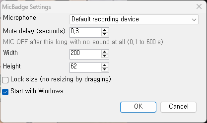
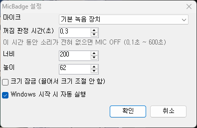

# MicBadge

A tiny always-on-top badge that shows whether your headset microphone is
really on — **MIC ON** or **MIC OFF** — for headsets whose mute button
Windows knows nothing about.

Many headsets (wireless gaming headsets in particular) mute the microphone
inside the headset itself. Windows still shows the microphone as active, so
nothing on screen tells you whether the button is pressed or not. MicBadge
listens for the faint background noise every live microphone picks up: as
long as that noise is there, the mic is on; when the signal drops to
complete silence, the physical mute button has been pressed.


  

## Features

- **Follows the physical mute button** — no driver, no vendor software
  integration, no hotkey to remember. Press the button on the headset and
  the badge changes.
- **Always visible** — stays on top of other windows, including borderless
  full-screen games, and never takes keyboard focus.
- **Put it anywhere, any size** — drag the badge to move it, drag its right
  or bottom edge to resize it. The text scales with the badge. Position and
  size are remembered.
- **Pick the microphone** — use the default recording device or choose a
  specific one.
- **Adjustable mute delay** — how long the signal has to stay silent before
  the badge turns to MIC OFF, from 0.1 seconds to 10 minutes.
- **Start with Windows** — one checkbox.
- **One small file** — a single `.exe` of about 20 KB, nothing to install,
  no background service.
- **English and Korean UI**, chosen from the Windows display language.

## Screenshots

The badge is green while the microphone is live, red once the headset's mute
button is pressed, and grey when the microphone cannot be opened (unplugged,
powered off).

  

Settings — right-click the badge and choose *Settings...*: microphone, mute
delay, exact badge size, size lock, and start with Windows.



## Quick start

1. Download `MicBadge.exe` from the
   [latest release](https://github.com/gmlwls768/MicBadge/releases/latest).
2. Put it in a folder of its own (its settings file is saved next to it) and
   run it. The badge appears in the top-right corner of the main screen.
3. Press the mute button on your headset — the badge switches between
   **MIC ON** and **MIC OFF**.

Requires Windows 10 or 11. Nothing else to install — the .NET Framework it
uses ships with Windows.

## Using the badge

| Action | Result |
| --- | --- |
| Drag the badge | Move it |
| Drag the right or bottom edge | Resize it |
| Right-click → *Settings...* | Open settings |
| Right-click → *Exit* | Close MicBadge |

## Configuration

| Setting | Description |
| --- | --- |
| Microphone | The recording device to watch. *Default recording device* follows whatever Windows uses by default. |
| Mute delay (seconds) | The badge turns to MIC OFF after this long with no sound at all. Default 0.3, range 0.1–600. |
| Width / Height | Exact badge size in pixels, as an alternative to dragging. |
| Lock size | Turns off resizing by dragging, so the edges only move the badge. |
| Start with Windows | Launches MicBadge when you sign in. |

Settings are stored in `MicBadge.ini` next to the `.exe`. If you move the
`.exe` to another folder, tick *Start with Windows* again so Windows starts
it from the new location.

## How it works

A live microphone is never perfectly silent — even in a quiet room it picks
up a little hiss. A headset that is muted with its own button sends nothing
at all. MicBadge reads the microphone's unprocessed signal ten times a
second and looks only at its level: any signal means the mic is on, and
pure silence for longer than the mute delay means the button is pressed.

Because MicBadge keeps the microphone open, Windows shows its
microphone-in-use icon in the taskbar while it runs.

## Compatibility

Built for and tested with the Logitech PRO X Wireless. It should work with
any headset or microphone whose mute button cuts the signal completely.

It cannot work with a microphone that keeps sending noise while muted. And
if your headset silences itself whenever the room is quiet, the badge may
show MIC OFF while you are simply not talking — raise the mute delay until
it stops.

To see what your microphone actually sends, run
`MicBadge.exe --log log.txt`: the lowest and highest level of each second is
written to the file together with the state shown.

## Building from source

No SDK needed — the C# compiler that ships with Windows is enough.

```
build.bat
```

This compiles `MicBadge.cs` into `MicBadge.exe`.

## License

MIT — see [LICENSE](LICENSE).

---

# MicBadge (한국어)

헤드셋 마이크가 실제로 켜져 있는지를 **MIC ON** / **MIC OFF** 로 화면에
항상 띄워 주는 작은 배지입니다. 음소거 버튼을 눌러도 Windows 가 알아채지
못하는 헤드셋을 위한 프로그램입니다.

무선 게이밍 헤드셋을 비롯한 많은 헤드셋은 음소거를 헤드셋 안에서 직접
처리합니다. Windows 에는 마이크가 계속 켜진 것으로 보이기 때문에, 버튼이
눌렸는지 안 눌렸는지 화면에서 확인할 방법이 없습니다. MicBadge 는 켜져
있는 마이크라면 항상 들어오는 잡소리(미세한 소리)를 감지합니다. 잡소리가
들어오면 마이크가 켜진 것이고, 신호가 완전히 끊기면 헤드셋의 물리 음소거
버튼이 눌린 것입니다.

  

## 주요 기능

- **헤드셋의 물리 음소거 버튼을 그대로 따라감** — 드라이버나 제조사
  프로그램 연동, 따로 외울 단축키가 없습니다. 헤드셋 버튼을 누르면 배지가
  바뀝니다.
- **항상 보임** — 다른 창 위에 떠 있고(테두리 없는 전체 화면 게임 포함),
  키보드 포커스를 가져가지 않습니다.
- **원하는 위치, 원하는 크기** — 배지를 끌어서 옮기고, 오른쪽·아래
  가장자리를 끌어서 크기를 바꿉니다. 글자는 배지 크기에 맞춰집니다. 위치와
  크기는 기억됩니다.
- **마이크 선택** — 기본 녹음 장치를 쓰거나 특정 장치를 고를 수 있습니다.
- **꺼짐 판정 시간 조절** — 소리가 얼마나 오래 없어야 MIC OFF 로 바꿀지
  0.1초부터 10분까지 정할 수 있습니다.
- **Windows 시작 시 자동 실행** — 체크 하나로 설정합니다.
- **작은 파일 하나** — 약 20KB 짜리 `.exe` 하나이며, 설치할 것도 백그라운드
  서비스도 없습니다.
- **영어/한국어 UI** — Windows 표시 언어에 따라 정해집니다.

## 스크린샷

마이크가 켜져 있으면 초록색, 헤드셋의 음소거 버튼을 누르면 빨간색, 마이크를
열 수 없으면(분리됨, 전원 꺼짐) 회색입니다.

  

설정 — 배지를 우클릭하고 *설정...* 을 고릅니다. 마이크, 꺼짐 판정 시간,
배지 크기, 크기 잠금, Windows 시작 시 자동 실행을 정할 수 있습니다.



## 빠른 시작

1. [최신 릴리스](https://github.com/gmlwls768/MicBadge/releases/latest)에서
   `MicBadge.exe` 를 받습니다.
2. 전용 폴더에 넣고(설정 파일이 exe 옆에 저장됩니다) 실행합니다. 배지가 주
   모니터의 오른쪽 위에 나타납니다.
3. 헤드셋의 음소거 버튼을 눌러 보세요. 배지가 **MIC ON** 과 **MIC OFF**
   사이에서 바뀝니다.

Windows 10 또는 11 이 필요합니다. 따로 설치할 것은 없습니다 — 사용하는
.NET Framework 는 Windows 에 들어 있습니다.

## 배지 사용법

| 동작 | 결과 |
| --- | --- |
| 배지를 끌기 | 위치 이동 |
| 오른쪽·아래 가장자리를 끌기 | 크기 조절 |
| 우클릭 → *설정...* | 설정 열기 |
| 우클릭 → *종료* | MicBadge 종료 |

## 설정

| 항목 | 설명 |
| --- | --- |
| 마이크 | 감시할 녹음 장치. *기본 녹음 장치* 는 Windows 의 기본 장치를 따릅니다. |
| 꺼짐 판정 시간(초) | 이 시간 동안 소리가 전혀 없으면 MIC OFF 로 바뀝니다. 기본 0.3, 범위 0.1~600. |
| 너비 / 높이 | 끌어서 맞추는 대신 배지 크기를 픽셀로 직접 지정합니다. |
| 크기 잠금 | 끌어서 크기를 바꾸는 기능을 끕니다. 가장자리를 끌어도 이동만 합니다. |
| Windows 시작 시 자동 실행 | 로그인할 때 MicBadge 를 실행합니다. |

설정은 `.exe` 옆의 `MicBadge.ini` 에 저장됩니다. `.exe` 를 다른 폴더로
옮겼다면 *Windows 시작 시 자동 실행* 을 다시 체크해야 새 위치에서
실행됩니다.

## 동작 원리

켜져 있는 마이크는 완전히 조용할 수 없습니다. 조용한 방에서도 미세한
잡소리가 들어옵니다. 반면 헤드셋 자체 버튼으로 음소거하면 아무 신호도
보내지 않습니다. MicBadge 는 마이크의 가공되지 않은 신호를 1초에 10번 읽어
크기만 확인합니다. 신호가 조금이라도 있으면 켜짐, 꺼짐 판정 시간보다 오래
완전한 무음이면 버튼이 눌린 것으로 봅니다.

MicBadge 가 마이크를 계속 열어 두기 때문에, 실행 중에는 작업 표시줄에
Windows 의 마이크 사용 중 아이콘이 표시됩니다.

## 호환성

Logitech PRO X Wireless 에 맞춰 만들고 시험했습니다. 음소거 버튼을 누르면
신호가 완전히 끊기는 헤드셋·마이크라면 동작할 것입니다.

음소거 중에도 잡음을 계속 보내는 마이크에서는 쓸 수 없습니다. 또 주변이
조용하면 스스로 소리를 끊는 헤드셋에서는 말을 안 하고 있을 뿐인데도 MIC
OFF 로 보일 수 있습니다. 그럴 때는 꺼짐 판정 시간을 늘려 보세요.

마이크가 실제로 어떤 신호를 보내는지 보려면 `MicBadge.exe --log log.txt`
로 실행합니다. 1초마다 그 사이의 최저·최고 크기와 표시 상태가 파일에
기록됩니다.

## 소스에서 빌드

SDK 가 필요 없습니다. Windows 에 들어 있는 C# 컴파일러면 됩니다.

```
build.bat
```

`MicBadge.cs` 를 컴파일해 `MicBadge.exe` 를 만듭니다.

## 라이선스

MIT — [LICENSE](LICENSE) 참고.
